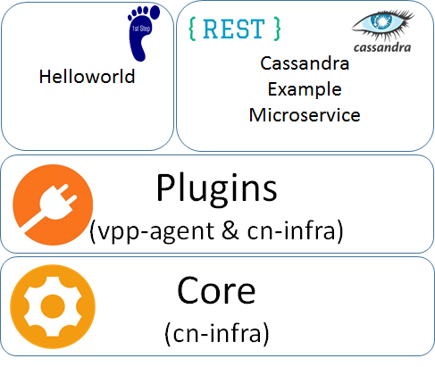

# CN sample service

[](https://travis-ci.org/ligato/cn-sample-service)
[](https://coveralls.io/github/ligato/cn-sample-service?branch=master)
[](https://goreportcard.com/report/github.com/ligato/cn-sample-service)
[](https://godoc.org/github.com/ligato/cn-sample-service)
[](https://github.com/ligato/cn-sample-service/blob/master/LICENSE)

The CN sample service showcases the extensibility of [vpp-agent](https://github.com/ligato/vpp-agent) 
and [cn-infra](https://github.com/ligato/cn-infra). Both vpp-agent and cn-infra have their own examples
but this dedicated repository demonstrates the [dependency management](Glide) and building using [makefiles](Makefile).
Use this repository as skeleton for your software projects (copy&paste it at the very beginning).




The sample service repository contains:
* [Hello World!](cmd/helloworld) - minimalistic extension of the vpp-agent
* [Cassandra](cmd/cassandra) - comming soon (it is supposed to showcase REST API calls that work with Cassandra)
* Plugins from [vpp-agent](https://github.com/ligato/vpp-agent/tree/master/plugins) and [cn-infra](https://github.com/ligato/cn-infra)
* [Core](https://github.com/ligato/cn-infra/tree/master/core) from cn-infra - lifecycle management of plugins (loading, 
initialization, unloading)

## Quickstart

The basic steps to setup a project:

Initialize a tool for management dependencies. This example uses [glide](https://github.com/Masterminds/glide).
We assume that glide is already installed if not, follow the instruction in its README.

```
glide init
```

Modify the content of the `glide.yaml` that defines dependencies of the project.
It is recommanded to pin dependencies to a particular commit id or a tag. The initial content
might look like this:

```yaml
package: cn-sample-service
import:
- package: github.com/ligato/vpp-agent
  version: 9b1e57b07a1dbda7e76f2fb0a7e2f584eb568b92
```

Download initial set of dependencies

```
glide install --strip-vendor
```

Once the initial set of dependencies is downloaded we can move to the writing of [custom plugin](cmd/helloworld).
The common tasks related to project development such as building, updating of dependencies, running of static
analysis and so on... can be automated using Makefile. Take a look at the [Makefile](Makefile) in this repository.

## Makefile
Source codes in this repository have own Makefile. This Makefile can be modified and extended based on requirements
of a particular software project. You can see that there are included targets from vpp-agent Makefile to minimize
repetitive lines in Makefile.

## Glide
Glide.yaml contains import of the vpp-agent therefore vendor directory in source codes of this repository
will contain all transitive dependencies of the vpp-agent. Note, if you use just subset of these vendor packages
golang will statically build/link only the subset (not all packages in vendor).